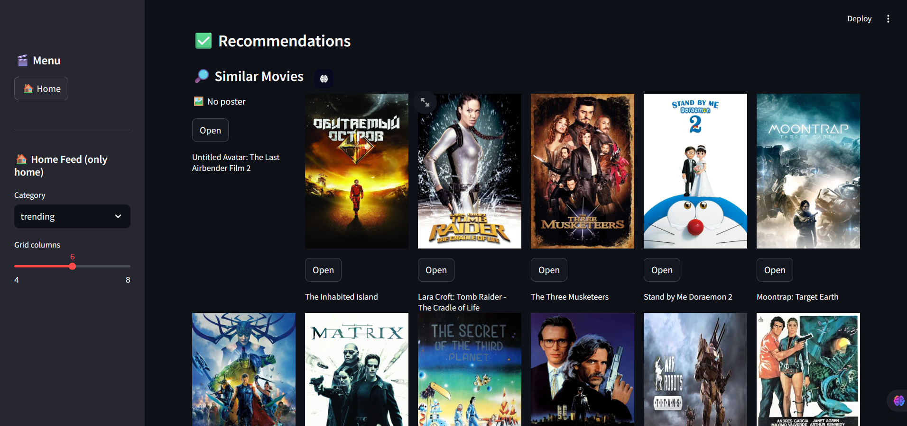
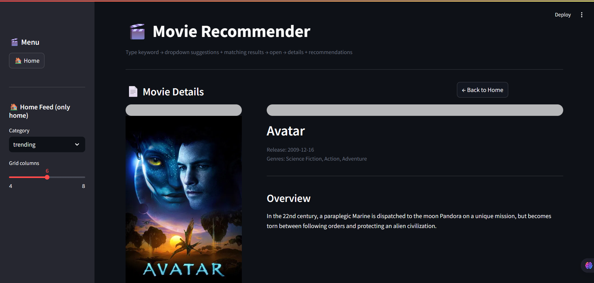

# 🎬 Movie Recommendation System

A powerful **Movie Recommendation System** built using **Machine Learning (TF-IDF)** + **FastAPI Backend** + **Streamlit UI**.
It recommends movies based on **content similarity + genre + TMDB data**.

---

## 🚀 Features

* 🔍 Search movies with autocomplete
* 🎯 Content-based recommendations (TF-IDF)
* 🎭 Genre-based recommendations
* 🎬 TMDB integration (posters, details)
* ⚡ FastAPI backend + Streamlit frontend
* 💡 Clean and modern UI

---

## 🛠️ Tech Stack

* **Frontend:** Streamlit
* **Backend:** FastAPI
* **ML:** TF-IDF (Scikit-learn)
* **API:** TMDB API
* **Language:** Python

---

## 📂 Project Structure

```
movie-rec/
│
├── app.py                # Streamlit frontend
├── main.py               # FastAPI backend
├── movies.ipynb          # ML model training
├── df.pkl                # Dataset
├── tfidf.pkl             # TF-IDF model
├── tfidf_matrix.pkl      # Matrix
├── indices.pkl           # Title index mapping
├── requirements.txt
└── README.md
```

---

## ⚙️ Setup Instructions

### 1️⃣ Clone Repository

```bash
git clone https://github.com/your-username/movie-rec.git
cd movie-rec
```

---

### 2️⃣ Create Virtual Environment

```bash
python -m venv venv
venv\Scripts\activate
```

---

### 3️⃣ Install Dependencies

```bash
pip install -r requirements.txt
```

---

### 4️⃣ Add TMDB API Key

Create `.env` file:

```
TMDB_API_KEY=your_api_key_here
```

---

### 5️⃣ Run Backend

```bash
uvicorn main:app --reload
```

---

### 6️⃣ Run Frontend

```bash
streamlit run app.py
```

---

## 📸 Screenshots

### 🏠 Home Page



### 📄 Movie Details




## 🧠 How It Works

1. User searches movie
2. TMDB API fetches movie details
3. TF-IDF model finds similar movies
4. Genre-based recommendations added
5. Results displayed with posters

---

## 🔥 Future Improvements

* ⭐ Rating-based recommendations
* 🎯 Hybrid model (TF-IDF + popularity)
* 📱 Mobile responsive UI
* 🚀 Deployment (Render / Vercel)

---

## 🤝 Contributing

Feel free to fork this repo and contribute!

---

## 📧 Contact

👤 Nikhil Kumawat
📩 Email: [nikhilkumawat7689@gmail.com](mailto:your-email@example.com)

---

⭐ If you like this project, give it a star!
